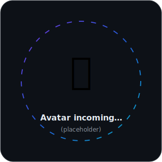
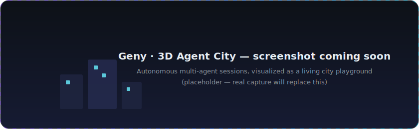
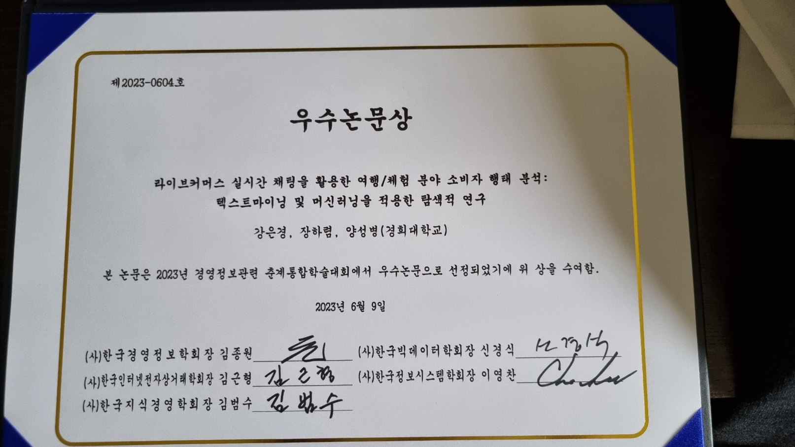
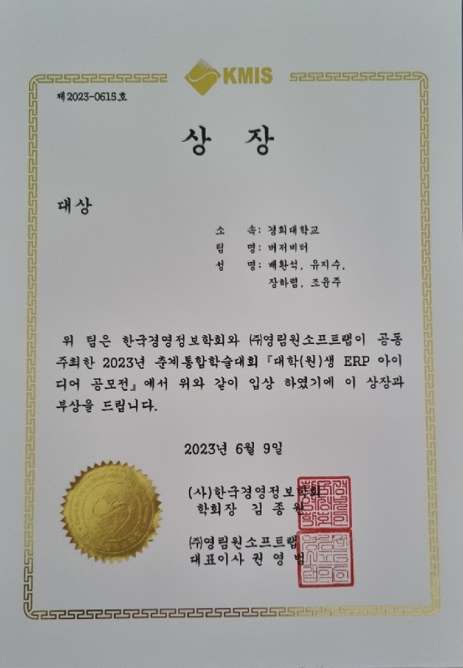

<!-- ══════════════════════════════ HERO ══════════════════════════════ -->

<div align="center">


[](https://hrletsgo.me)

**지식과 상상력을 세상에 구현하는 AI 서비스 공학자**

<br/>

<a href="https://hrletsgo.me"></a>
<a href="https://huggingface.co/CocoRoF"></a>
<a href="https://github.com/CocoRoF"></a>
<a href="mailto:gkfua00@plateer.com"></a>

<br/><br/>

<picture>
  <source media="(prefers-color-scheme: dark)" srcset="assets/snake-dark.svg"/>
  
</picture>

</div>

<!-- ══════════════════════════════ ABOUT ══════════════════════════════ -->

## 🧭 About Me



```python
from plateer import AIRnD

me = AIRnD.PartLeader(
    name  = "HaRyeom Jang (장하렴)",
    role  = "AI Agent Engineer · AI 서비스 공학자",
    base  = "Seoul, Korea 🇰🇷",

    work  = "Xgen — enterprise LLM platform "
            "(retail · finance deployments)",
    side  = "Geny — multi-agent playground with "
            "live avatars & real-time TTS",

    creed = "Build what's needed 1–2 years from now, "
            "and make it run today.",
)
```

I design and run the **full lifecycle of LLM products** — training pipelines,
GPU serving, agent harnesses, and document-to-context (RAG) systems.
By day I lead product development for **[Xgen](https://hrletsgo.me)** at **Plateer AI R&D**;
by night I grow **[Geny](https://github.com/CocoRoF/Geny)**, an autonomous multi-agent city where my experiments live.

<br clear="right"/>


<!-- ══════════════════════════════ EXPERTISE ══════════════════════════════ -->

## 🎯 Areas of Expertise

<div align="center">


</div>


<!-- ══════════════════════════════ PROJECTS ══════════════════════════════ -->

## 🚀 Featured Projects

<table>
<tr>
<td width="50%" valign="top">

### 🏙️ [Geny](https://github.com/CocoRoF/Geny) 

Autonomous **multi-agent system** — manage multiple agent sessions, orchestrate long-running tasks, and watch it all unfold in a **3D city playground**.

`multi-agent` `orchestration` `three.js` `TTS`

</td>
<td width="50%" valign="top">

### 📄 [Contextifier](https://github.com/CocoRoF/Contextifier) 

Document processing library that turns raw documents into **AI-understandable context** — analyze, restructure, normalize, then let the model reason.

`doc-parsing` `RAG` `context-engineering`

</td>
</tr>
<tr>
<td width="50%" valign="top">

### 🎨 [geny-svgforge](https://github.com/CocoRoF/geny-svgforge) 

AI hands over **meaning (spec), not coordinates** — deterministic layout engine renders clean diagram SVGs. Built as a Tool/MCP for agents that draw.

`diagrams` `deterministic-layout` `MCP`

</td>
<td width="50%" valign="top">

### 🖥️ [edit2ppt](https://github.com/CocoRoF/edit2ppt) 

**Chat-driven PPTX studio** — restyle or extend existing deck templates by talking to it. Korean-first [web UI](https://github.com/CocoRoF/edit2ppt-web) served at hrletsgo.me.

`pptx` `template-engine` `agent-editing`

</td>
</tr>
<tr>
<td width="50%" valign="top">

### 🌐 Agent-Native Web Stack

Browsers and search built *for agents, not humans* —
**[an-web](https://github.com/CocoRoF/an-web)** (AI-native browser engine) · **[playwLeft](https://github.com/CocoRoF/playwLeft)** (Rust automation) · **[pybrowser](https://github.com/CocoRoF/pybrowser)** · **[googer](https://github.com/CocoRoF/googer)**

`rust` `headless` `tool-use`

</td>
<td width="50%" valign="top">

### 🧑‍🎤 [geny-2d-avatar](https://github.com/CocoRoF/geny-2d-avatar) 

Semi-automated **avatar production platform** — AI-redesigned parts on standardized 2D rigs. With [geny-avatar](https://github.com/CocoRoF/geny-avatar): Live2D-style editor + AI textures.

`live2d` `cubism` `genai`

</td>
</tr>
</table>

<div align="center">



<sub>…and 70+ more experiments in [my repositories](https://github.com/CocoRoF?tab=repositories) · full write-ups at [hrletsgo.me](https://hrletsgo.me)</sub>

</div>


<!-- ══════════════════════════════ MODELS ══════════════════════════════ -->

## 🤗 Open Models

> Trained, distilled and shipped from my own pipelines — all on [**HuggingFace → CocoRoF**](https://huggingface.co/CocoRoF)

| Line | What it is | Highlights |
|:----:|:-----------|:-----------|
| **POLAR** | Post-trained LLM lineup (DPO / GRPO / GIST distillation) | `POLAR_gemma-3-4b-dpo` · `POLAR-Qwen3-0.6b-linq-gist` |
| **KoModernBERT** | Korean ModernBERT pre-training line | `KoModernBERT-large-mlm` series |
| **ModernBERT-SimCSE** | Korean sentence embeddings (SimCSE, multitask distill) | retrieval-ready encoder line |


<!-- ══════════════════════════════ STACK ══════════════════════════════ -->

## 🛠️ Tech Stack

<div align="center">

**AI / LLM Engineering**

       

**Languages & Frameworks**


**Infra & Tools**


</div>


<!-- ══════════════════════════════ RESEARCH ══════════════════════════════ -->

## 📚 Research & Writing

<div align="center">


</div>

- 📘 **『랭체인으로 구현하는 AI 서비스 & 에이전트 개발 입문』** — Technical Reviewer (영진닷컴, 2026)
- 📈 *Stock Price Prediction via Discussion Forum Analysis* — **IEEE Access**, 2024
- 🏅 **Best Paper Award** — Korea Society of MIS (KMIS), 2024
- 🎤 Conference talks on controllable GenAI, RL-based prediction, live-commerce behavior analysis — KMIS · KIIS · KMA

<details>
<summary><b>🏆 Full awards & honors (13)</b></summary>

<br/>

| Year | Achievement | Organization |
|:----:|:------------|:-------------|
| 2024 | 🥇 **BI Competition Grand Prize** *(2nd consecutive year)* | Ministry of Trade, Industry & Energy |
| 2024 | 🏅 **Best Paper Award** | Korea Society of MIS |
| 2023 | 🥇 **Public Data BI Competition Grand Prize** | Ministry of Trade, Industry & Energy |
| 2023 | 🥇 **ERP Innovation Contest Grand Prize** | Youngrim Won |
| 2022 | 🎓 **KHU Fellowship Scholar** | Kyung Hee University |
| 2018–19 | 🥇 **Literary Contest Grand Prize ×3** | Sahmyook University |

<div align="center">

&nbsp;

</div>

</details>


<!-- ══════════════════════════════ STATS ══════════════════════════════ -->

## 📊 GitHub

<div align="center">


<br/><br/>


</div>

<!-- ══════════════════════════════ FOOTER ══════════════════════════════ -->

<div align="center">

### *"Build what the future needs — one or two years early."*


</div>
